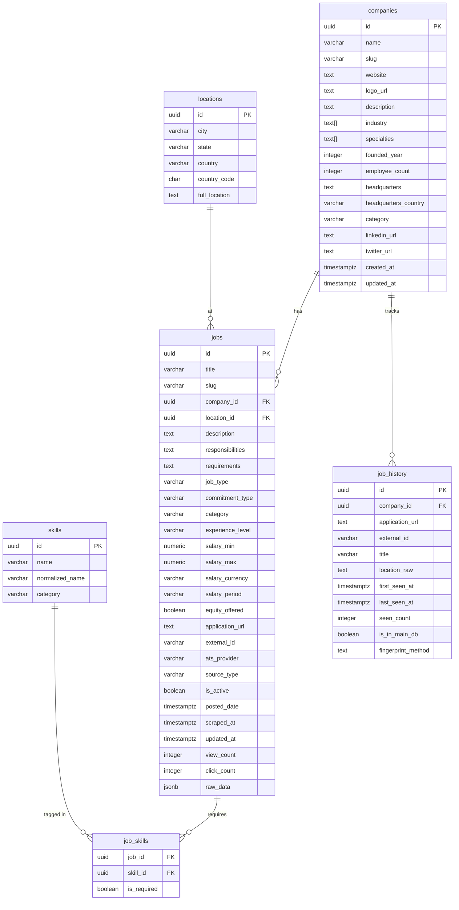
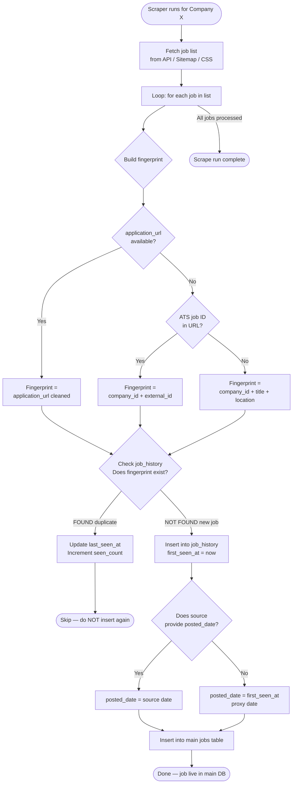
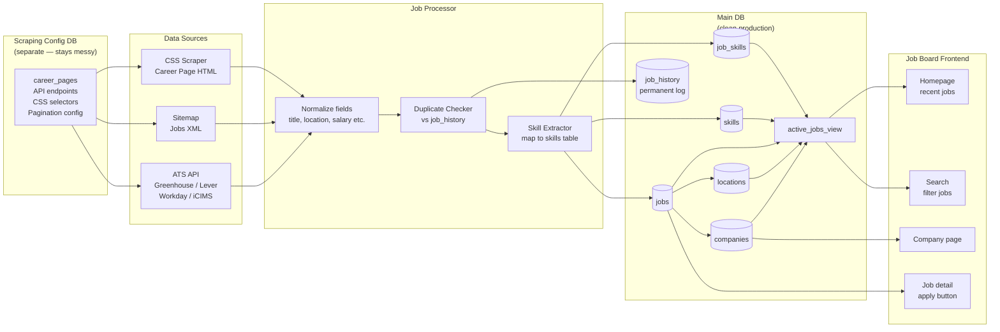
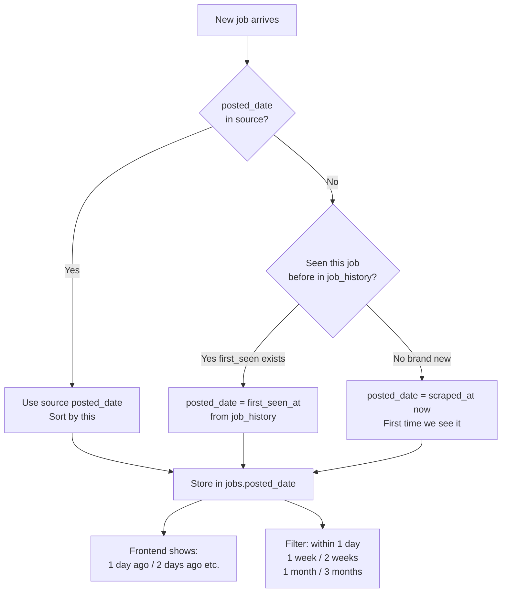

# Schema & Data Flow

## 1. Schema Relationships

---

## 2. Duplicate Check Flow

---

## 3. Full Data Pipeline Flow

---

## 4. Posted Date Logic

---

## 5. job_history Table — Why It Exists

| Problem | How job_history solves it |
|---|---|
| Company re-posts same job | `fingerprint` match → skip insert |
| No posted_date from source | `first_seen_at` = proxy date |
| Scraper runs every day | `last_seen_at` updates, no duplicate rows |
| Want to know job age | `now() - first_seen_at` = approximate age |
| Track scraping reliability | `seen_count` shows how many times a job appeared |
| Company removes job | `last_seen_at` stops updating → can detect stale jobs later |

**This table is never deleted from.** It's a permanent audit log.
Every company's entire job history lives here for cross-checking.
